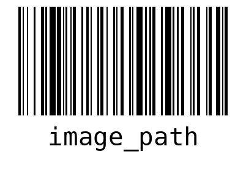

# Gerador de Código de Barras
Um mini projeto para geração de código de barras a partir de um texto.




## Principais ferramentas utilizadas:
- python
- Flask
- virtualenv
- python-barcode
- pylint
- pre-commit


## Procedimentos para utilização
Realize o download do projeto em sua máquina:
```
git clone https://github.com/rad-silva/barcode-generator.git
```

Crie e ative um ambiente virtual python:
```
. .venv/bin/activate
```

Installe as dependências necessárias:
```
pip3 install -r requirements.txt
```

Rode a aplicação:
```
python3 run.py
```
